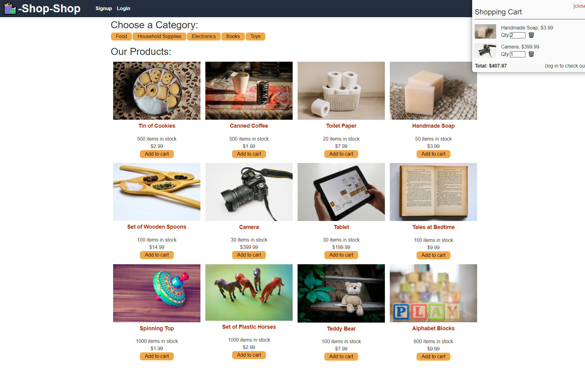

# Shop-Shop (Redux)

## Purpose
To take a pre-existing project built with the MERN stack and replace the React StoreContext with a Redux PRovider to handle the global state. 

## Built With
* MongoDB
* ExpressJS
* React/Redux
* NodeJS

## Contents (New Material)
The parts of the code containing the new additions can be found in the client folder. Inside is the store.js file that creates the Store used for the global state. Inside of the utils directory there is the slices directory. Inside are the cartSlice.js, categorySlice.js, and productSlice.js files. These slices contain the name for the slice, initial state for each portion, reducers, and actions. These are imported into the store.js file.   
## Screenshot

## Deployed At
https://tranquil-ocean-75871.herokuapp.com/

## Contribution
Made with ❤️ by DragoonKite

### ©️2021 Frank DePaolo